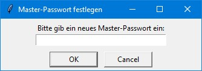
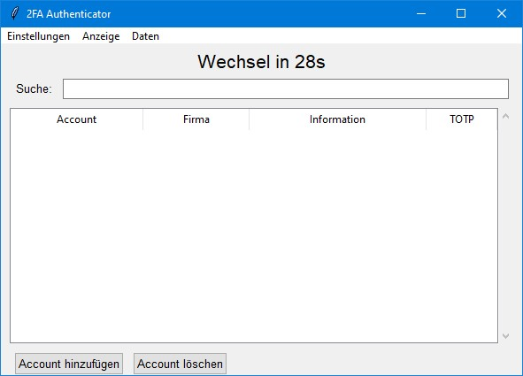
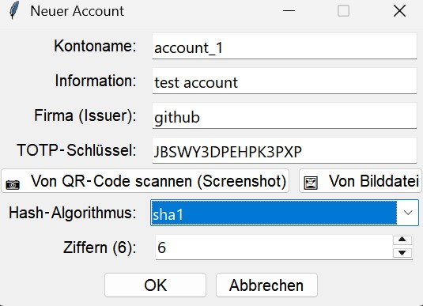
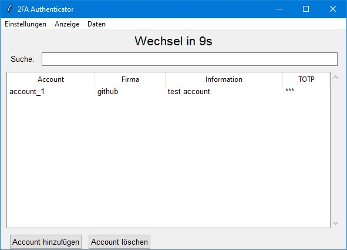
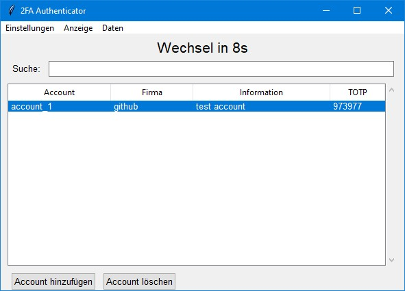
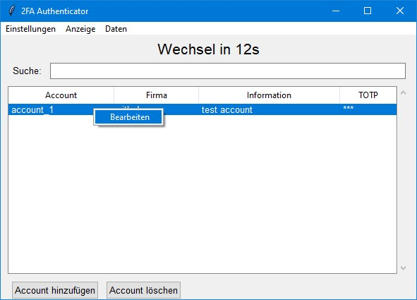

## Kurze Beschreibung

**Sicherer 2FA-Authenticator mit verschlüsselter Datenspeicherung**

Desktop-Anwendung für TOTP-basierte Zwei-Faktor-Authentifizierung mit AES-GCM-Verschlüsselung und Argon2-Key-Derivation. Speichert alle Accounts lokal und verschlüsselt mit Master-Passwort. Unterstützt Import/Export, automatisches Lock-out bei Inaktivität und anpassbare Oberfläche.

---

## Ausführliche Beschreibung

# 2FA Authenticator

Ein sicherer Desktop-Authenticator für Zwei-Faktor-Authentifizierung (2FA) mit verschlüsselter lokaler Datenspeicherung.

## Bebildert

### Masterpasswort und erstellen der Datenbank
Bitte die Konfiguration ggf. anpassen. Nicht alle haben genug Arbeitsspeicher oder CPU-Kerne. 
Wird nur eins von den 3 Einstellungen *Nachträglich* geändert, so ändert sich die Berechnung und das Masterpasswort funktioniert nicht mehr.
Also bitte vor dem erstellen einer Datenbank (`authenticator_data.json`) diese Einstellungen anpassen!

Starten mit vorliegenden Einstellungen
```python
ARGON_TIME_COST    = 20          # CPU-Aufwand für Argon2
ARGON_MEMORY_COST  = 1024 * 1024 # 1 GiB Speicher
ARGON_PARALLELISM  = 4           # Anzahl paralleler Threads
```
 → 

Datenbank erstellt im gleichen Ordner: `authenticator_data.json`
### Neuen Account erstellen
Untere Knöpfe: Account Hinzufügen.



### Hinzufügen neuer Daten
Einfügen der Informationen und im Anschluss auf `OK`.


#### Weitere Accounts 



#### 30 Sekunden Token
Klick auf die \* und das Token wird in die Zwischenablage kopiert!



#### Bearbeiten des Accounts
In der GUI: Rechtsklick → bearbeiten.




## 🔐 Hauptmerkmale

### Sicherheit
- **AES-GCM-Verschlüsselung**: Alle Daten werden mit modernster AEAD-Verschlüsselung gesichert
- **Argon2-Key-Derivation**: Robuste Passwort-Hashing-Funktion mit konfigurierbaren Parametern
- **Automatisches Lock-out**: Sperrt sich nach 5 Minuten Inaktivität
- **Lokale Datenspeicherung**: Keine Cloud, alle Daten bleiben auf Ihrem Gerät

### Funktionen
- **TOTP-Unterstützung**: Kompatibel mit gängigen 2FA-Diensten (Google, Microsoft, GitHub, etc.)
- **Mehrere Hash-Algorithmen**: SHA1, SHA256, SHA512
- **Flexible Code-Längen**: 4-8 Ziffern
- **Import/Export**: Daten-Backup mit optionaler Verschlüsselung
- **Live-Suche**: Schnelles Filtern nach Name, Firma oder Information
- **Countdown-Timer**: Zeigt verbleibende Zeit bis zum Code-Wechsel an
- **Anpassbare Oberfläche**: Schriftgröße individuell einstellbar

### Benutzerfreundlichkeit
- **Einfaches Kopieren**: Klick auf Code kopiert ihn in die Zwischenablage
- **Übersichtliche Struktur**: Sortierung nach Account, Firma und Information
- **Kontextmenü**: Schnelles Bearbeiten per Rechtsklick
- **Master-Passwort ändern**: Jederzeit neue Verschlüsselung möglich

## 📋 Voraussetzungen

```bash
pip install pyotp cryptography argon2-cffi
```

**Erforderliche Python-Pakete:**
- `pyotp` - TOTP-Code-Generierung
- `cryptography` - AES-GCM-Verschlüsselung
- `argon2-cffi` - Sichere Key-Derivation
- `tkinter` - GUI (meist vorinstalliert)

## 🚀 Installation & Start

1. Abhängigkeiten installieren:
   ```bash
   pip install pyotp cryptography argon2-cffi
   ```

2. Programm starten:
   ```bash
   python 2FA.py
   ```
   oder umbenennen in `2FA.pyw` → kein Terminal mehr.
   ```bash
   python 2FA.pyw
   ```

3. Beim ersten Start Master-Passwort festlegen

## 💾 Datenspeicherung

Die verschlüsselte Datenbank wird als `authenticator_data.json` im Programmverzeichnis gespeichert. Die Datei enthält:
- Salt für Key-Derivation (Base64-kodiert)
- Verschlüsselte Account-Daten (AES-GCM)

**Wichtig**: Bewahren Sie Ihr Master-Passwort sicher auf. Ohne dieses können die Daten nicht wiederhergestellt werden!

## 🔧 Konfiguration

In der Datei sollten folgende Parameter angepasst werden:

```python
ARGON_TIME_COST    = 20          # CPU-Aufwand für Argon2
ARGON_MEMORY_COST  = 1024 * 1024 # 1 GiB Speicher
ARGON_PARALLELISM  = 4           # Anzahl paralleler Threads
```

**⚠️ Achtung**: Änderungen an den Verschlüsselungsparametern machen bestehende Datenbanken unbrauchbar!

## 📤 Import/Export

### Export
- **Unverschlüsselt**: JSON-Format für Kompatibilität
- **Verschlüsselt**: Mit Master-Passwort geschützte Backup-Datei

### Import
- Unterstützt eigenes verschlüsseltes Format
- Kompatibel mit Google Authenticator Export-Format
- Accounts können hinzugefügt oder ersetzt werden

## 🛡️ Sicherheitshinweise

- Die Verschlüsselung ist sehr stark (Argon2 + AES-GCM)
- Regelmäßige Backups erstellen (Export-Funktion nutzen)
- Master-Passwort sicher verwahren
- Keine Passwort-Wiederherstellung möglich
- Inaktivitäts-Timeout nicht deaktivierbar (Sicherheitsfeature)

## 📝 Lizenz

MIT License (Non-Commercial)

Copyright © 2025 Waldemar Koch

Kostenlose Nutzung für nicht-kommerzielle Zwecke. Kommerzielle Nutzung erfordert schriftliche Genehmigung.

## 🤝 Beitragen

Verbesserungsvorschläge und Bug-Reports sind willkommen! Bitte erstellen Sie ein Issue oder Pull Request.

## ⚠️ Haftungsausschluss

Diese Software wird "wie besehen" bereitgestellt, ohne jegliche Garantie. Nutzen Sie sie auf eigene Verantwortung.

---

**Version**: 1.0.5  
**Letzte Aktualisierung**: 2025-10-15
