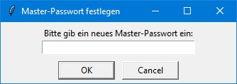
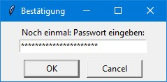
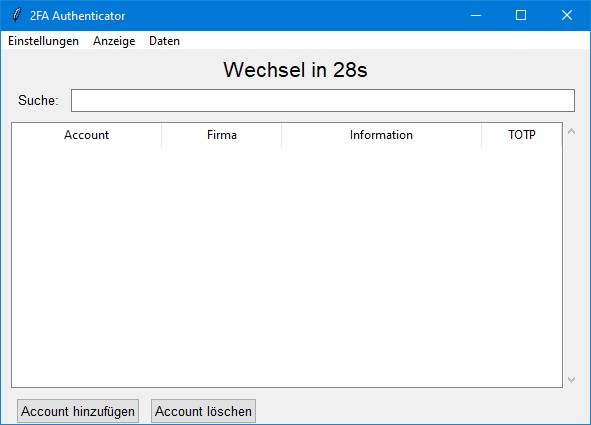
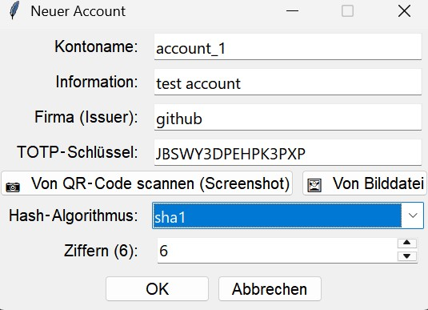
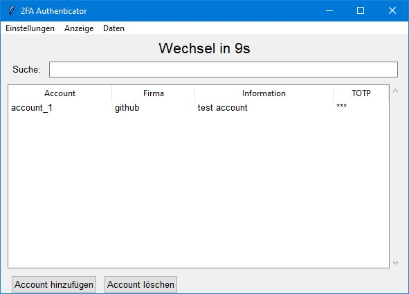
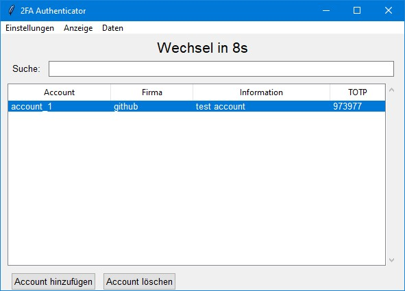
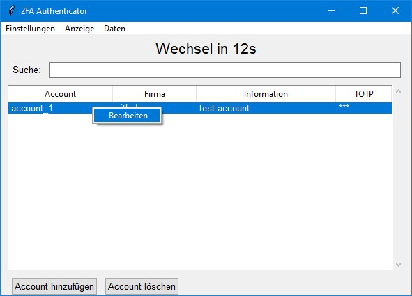

## Kurze Beschreibung

**Sicherer 2FA-Authenticator mit verschlüsselter Datenspeicherung**

Desktop-Anwendung für TOTP-basierte Zwei-Faktor-Authentifizierung mit AES-GCM-Verschlüsselung und Argon2-Key-Derivation. Speichert alle Accounts lokal und verschlüsselt mit Master-Passwort. Unterstützt Import/Export, QR-Code-Scan, automatisches Lock-out bei Inaktivität, individuelle TOTP-Perioden pro Account und eine anpassbare Oberfläche.

---

## Ausführliche Beschreibung

# 2FA Authenticator

Ein sicherer Desktop-Authenticator für Zwei-Faktor-Authentifizierung (2FA) mit verschlüsselter lokaler Datenspeicherung.

## Bebildert

### Masterpasswort und Erstellen der Datenbank

Bitte die Konfiguration ggf. anpassen. Nicht alle haben genug Arbeitsspeicher oder CPU-Kerne.

Wird nur eine der 3 Einstellungen **nachträglich** geändert, ändert sich die Schlüsselberechnung und das Masterpasswort funktioniert für bestehende Datenbanken nicht mehr.

Also bitte vor dem Erstellen einer Datenbank (`authenticator_data.json`) diese Einstellungen anpassen!

Starten mit vorliegenden Einstellungen:

```python
ARGON_TIME_COST    = 20          # CPU-Aufwand für Argon2
ARGON_MEMORY_COST  = 1024 * 1024 # 1 GiB Speicher
ARGON_PARALLELISM  = 4           # Anzahl paralleler Threads
```

 → 

Datenbank wird im gleichen Ordner erstellt:

```text
authenticator_data.json
```

Zusätzlich wird eine Lock-Datei verwendet, um parallele App-Instanzen zu verhindern. Die Datei bleibt nach dem Beenden bestehen; entscheidend ist die vom Betriebssystem gehaltene Sperre:

```text
authenticator_data.lock
```

### Neuen Account erstellen

Untere Knöpfe: **Account hinzufügen**.



### Hinzufügen neuer Daten

Einfügen der Informationen und im Anschluss auf `OK`.

> **Hinweis:** Die Felder „Information“ und „Firma (Issuer)“ sind optional.  
> Pflichtfelder sind **Kontoname** und **TOTP-Schlüssel**.  
> Zusätzlich können Hash-Algorithmus, Ziffernanzahl und TOTP-Periode angepasst werden.



#### QR-Code scannen

Im Hinzufügen- und Bearbeiten-Dialog stehen zwei Schaltflächen bereit:

- **Von QR-Code scannen (Screenshot)** – Markiert per Maus einen Bereich auf dem Bildschirm. Der QR-Code wird sofort ausgelesen und die Felder werden automatisch ausgefüllt.
- **Von Bilddatei** – Öffnet eine Bilddatei, z. B. PNG, JPG oder BMP, und liest den QR-Code daraus.

> **Voraussetzung:**  
> `pip install pillow zxing-cpp numpy`  
> Sind diese Pakete nicht installiert, werden die Schaltflächen nicht angezeigt. Das Programm läuft weiterhin normal.

#### Weitere Accounts



#### TOTP-Code kopieren

In der Spalte **TOTP** auf `***` klicken.  
Der aktuelle Code wird angezeigt und automatisch in die Zwischenablage kopiert.

Die Spalte **Ablauf** zeigt pro Account, wann der Code erneuert wird.



#### Bearbeiten des Accounts

In der GUI: Rechtsklick → **Bearbeiten**.

- Alle Felder können geändert werden, einschließlich des TOTP-Schlüssels.
- Das Schlüssel-Feld ist standardmäßig maskiert.
- Mit „Schlüssel anzeigen?“ wird der Klartext eingeblendet.
- Auch im Bearbeitungs-Dialog steht der QR-Code-Scanner zur Verfügung.
- Die TOTP-Periode kann pro Account angepasst werden.



---

## Hauptmerkmale

### Sicherheit

- **AES-GCM-Verschlüsselung**: Alle Daten werden mit AEAD-Verschlüsselung gesichert
- **Argon2-Key-Derivation**: Robuste Schlüsselableitung mit konfigurierbaren Parametern
- **Automatisches Lock-out**: Sperrt sich nach 5 Minuten Inaktivität
- **Single-Instance-Lock**: Verhindert parallele Schreibzugriffe durch mehrere App-Instanzen
- **Lokale Datenspeicherung**: Keine Cloud, alle Daten bleiben auf Ihrem Gerät
- **Master-Passwort**: Wird nicht gespeichert, sondern nur zur Schlüsselableitung genutzt

### Arbeitsspeicher und Sitzungssperre

- Das Master-Passwort wird nach der Schlüsselableitung nicht als Sitzungszustand aufbewahrt. Speichern und verschlüsselter Export verwenden den abgeleiteten 256-Bit-Schlüssel in einem überschreibbaren `bytearray`.
- Dieser Schlüssel und die TOTP-Schlüssel werden während der entsperrten Sitzung benötigt. Der Sitzungsschlüssel ermöglicht die Entschlüsselung der Datenbank und ist entsprechend genauso schützenswert wie das Passwort.
- Bei Inaktivität und beim Beenden wird der eigene Schlüsselpuffer mit Nullen überschrieben. Account-Referenzen und sichtbare Daten werden entfernt. Beim Entsperren wird die Datenbank neu geladen.
- Läuft die Inaktivitätsfrist während eines offenen Account-, Import-, Export- oder Passwortdialogs ab, wird die Anwendung beendet. Dadurch können pausierte Dialogfunktionen keine alten Geheimnisse in die nächste Sitzung übernehmen. Noch nicht bestätigte Eingaben gehen verloren.
- Kopierte Codes werden nach 15 Sekunden sowie beim Sperren/Beenden aus der Zwischenablage entfernt, sofern dort noch derselbe Code steht. Zwischenablageverlauf und externe Clipboard-Manager können eigene Kopien behalten.
- Neue Passwörter dürfen nicht leer sein. Beim Passwortwechsel wird das aktuelle Passwort durch erneute Schlüsselableitung geprüft; der alte Sitzungsschlüssel wird erst nach erfolgreichem Speichern überschrieben.
- TOTP-Eingabefelder sind standardmäßig maskiert, auch nach QR-Import. Das Schlüsselfeld wird vor dem Zerstören des Dialogs geleert.

**Grenzen:** Python-Strings und `bytes` sind unveränderlich. Tkinter, JSON, PyOTP und die Kryptografie-Bibliotheken können interne Kopien anlegen, die dieses Programm nicht zuverlässig überschreiben kann. Das Entfernen einer Referenz garantiert keine physische Speicherlöschung. Es gibt keinen vollständigen Schutz vor Prozessspeicherzugriff, Speicherauslagerung, Ruhezustandsdateien oder Speicherabbildern. Ein entsperrter Authenticator muss TOTP-Schlüssel verarbeiten können. Die Bereinigung reduziert die Lebensdauer und Anzahl eigener Kopien, ist aber keine garantierte Löschung aller Geheimnisse. Während synchroner Rechen- oder Dateioperationen kann Tkinter die Inaktivitätssperre erst nach deren Rückkehr ausführen.

Das bestehende Dateiformat und die Argon2-Parameter bleiben unverändert. Dateien sind auf 16 MiB begrenzt. Speichern erfolgt über eine zufällige temporäre Datei und atomaren Austausch. Unter POSIX haben neue Dateien nur Benutzerrechte (`0600`); unter Windows gelten die geerbten Verzeichnisrechte. Ein Klartextexport benötigt eine zusätzliche ausdrückliche Bestätigung. Die aktive Datenbank und ihre Lock-Datei können nicht als Exportziel verwendet werden.

Technische Referenzen: [Argon2-Schlüsselableitung](https://argon2-cffi.readthedocs.io/en/stable/api.html), [AES-GCM](https://cryptography.io/en/stable/hazmat/primitives/aead/).

Sicherheitsregressionen prüfen: `python -m unittest discover -s tests -v`. Die Tests verwenden ausschließlich synthetische Daten und temporäre Dateien; die Argon2-Kosten werden nur für Tests reduziert. Die Dialogsteuerung wird dabei simuliert.

### Funktionen

- **TOTP-Unterstützung**: Kompatibel mit gängigen 2FA-Diensten
- **Individuelle TOTP-Periode**: Pro Account kann eine eigene Ablaufzeit gesetzt werden
- **QR-Code-Scan**: Direkt per Screenshot-Auswahl oder Bilddatei
- **Mehrere Hash-Algorithmen**: SHA1, SHA256, SHA512
- **Flexible Code-Längen**: 4–10 Ziffern
- **Import/Export**: Daten-Backup mit optionaler Verschlüsselung
- **Import-Validierung**: Fehlerhafte Accounts werden erkannt und können übersprungen werden
- **Live-Suche**: Filtern nach Name, Firma oder Information
- **Countdown pro Account**: Jede Zeile zeigt die verbleibende Zeit bis zum Code-Wechsel
- **Farbliche Ablaufwarnung**: Codes kurz vor Ablauf werden farblich markiert
- **Anpassbare Oberfläche**: Schriftgröße individuell einstellbar
- **DPI-/HiDPI-Unterstützung**: Verbesserte Darstellung und Screenshot-Koordinaten, insbesondere unter Windows

### Benutzerfreundlichkeit

- **Einfaches Kopieren**: Klick auf TOTP-Feld kopiert den Code in die Zwischenablage
- **Übersichtliche Struktur**: Darstellung nach Account, Firma, Information, Ablauf und TOTP
- **Kontextmenü**: Schnelles Bearbeiten per Rechtsklick
- **Master-Passwort ändern**: Jederzeit neue Verschlüsselung möglich
- **Optionale Felder**: Information und Firma sind nicht zwingend erforderlich
- **Dialog-Komfort**: Dialoge werden zentriert; `Enter` bestätigt, `Escape` bricht ab

---

## Voraussetzungen

### Minimum

```bash
pip install pyotp cryptography argon2-cffi
```

### Optional für QR-Code-Scan

```bash
pip install pillow zxing-cpp numpy
```

### Volle Funktionalität

```bash
pip install pyotp cryptography argon2-cffi pillow zxing-cpp numpy
```

### Bibliothekenbeschreibungen

**Erforderliche Python-Pakete:**

- `pyotp` – TOTP-Code-Generierung
- `cryptography` – AES-GCM-Verschlüsselung
- `argon2-cffi` – sichere Key-Derivation
- `tkinter` – GUI, meist bei Python bereits enthalten

**Optionale Pakete für QR-Code-Scan:**

- `pillow` – Bildverarbeitung und Screenshots
- `zxing-cpp` – QR-Code- und Barcode-Dekodierung
- `numpy` – Bilddaten-Konvertierung für `zxing-cpp`

---

## Installation & Start

1. Repository herunterladen oder Datei speichern.

2. Abhängigkeiten installieren.

   Für volle Funktionalität:

   ```bash
   pip install pyotp cryptography argon2-cffi pillow zxing-cpp numpy
   ```

   Oder nur notwendige Abhängigkeiten:

   ```bash
   pip install pyotp cryptography argon2-cffi
   ```

   Optional für QR-Scan:

   ```bash
   pip install pillow zxing-cpp numpy
   ```

3. Programm starten:

   ```bash
   python 2FA.py
   ```

   Oder Datei in `2FA.pyw` umbenennen, damit unter Windows kein Terminalfenster geöffnet wird:

   ```bash
   python 2FA.pyw
   ```

   Alternativ per Doppelklick starten.

4. Beim ersten Start Master-Passwort festlegen.

---

## Datenspeicherung

Die verschlüsselte Datenbank wird als `authenticator_data.json` im Programmverzeichnis gespeichert.

Die Datei enthält:

- Salt für Key-Derivation, Base64-kodiert
- verschlüsselte Account-Daten, AES-GCM

Während der Laufzeit wird außerdem eine Lock-Datei verwendet:

```text
authenticator_data.lock
```

Diese verhindert, dass mehrere Instanzen gleichzeitig dieselbe Datenbank bearbeiten.

> **Wichtig:** Bewahren Sie Ihr Master-Passwort sicher auf. Ohne dieses können die Daten nicht wiederhergestellt werden.

---

## Konfiguration

In der Datei können folgende Parameter angepasst werden:

```python
ARGON_TIME_COST    = 20          # CPU-Aufwand für Argon2
ARGON_MEMORY_COST  = 1024 * 1024 # 1 GiB Speicher
ARGON_PARALLELISM  = 4           # Anzahl paralleler Threads
```

> **Achtung:** Änderungen an diesen Verschlüsselungsparametern machen bestehende Datenbanken ohne Migration unlesbar, da die Parameter aktuell nicht in der Datenbankdatei gespeichert werden.

Weitere relevante Standardwerte:

```python
COUNTDOWN_START = 30
DEFAULT_PERIOD = COUNTDOWN_START

HASH_OPTIONS = ("sha1", "sha256", "sha512")
DEFAULT_DIGITS = 6
DEFAULT_HASH = "sha1"
```

Die Inaktivitätszeit kann im Code angepasst werden:

```python
self.inactivity_timeout = 5 * 60
```

---

## Import/Export

### Export

- **Unverschlüsselt**: JSON-Format für Kompatibilität
- **Verschlüsselt**: Mit Master-Passwort geschützte Backup-Datei
- Export enthält Account-Name, Issuer/Firma, Notiz/Information, Secret, Algorithmus, Ziffernanzahl und Periode

### Import

- Unterstützt eigenes verschlüsseltes Format
- Unterstützt Aegis-kompatibles JSON-Format
- Accounts können vollständig ersetzt oder zusammengeführt werden
- Bei gleichem `Name + Information` wird der vorhandene Account ersetzt
- Fehlerhafte Accounts werden erkannt und können übersprungen werden
- Bei verschlüsselten Importen mit fremdem Passwort wird das eigene Master-Passwort nicht verändert

---

## Sicherheitshinweise

- Die Datenbank ist mit Argon2 + AES-GCM verschlüsselt
- Regelmäßige Backups erstellen, z. B. über die Export-Funktion
- Master-Passwort sicher verwahren
- Keine Passwort-Wiederherstellung möglich
- Änderungen an Argon2-Parametern machen bestehende Datenbanken ohne Migration unlesbar
- Die Anwendung verhindert parallele Instanzen, um Datenverlust durch gleichzeitiges Schreiben zu vermeiden
- Inaktivitäts-Timeout ist standardmäßig auf 5 Minuten gesetzt und kann im Code über `self.inactivity_timeout` angepasst werden
- Verschlüsselte Backups sollten ebenfalls sicher gespeichert werden

---

## Lizenz

Custom Non-Commercial License

Copyright © 2025 Waldemar Koch

Kostenlose Nutzung, Kopieren, Ändern und Verteilen ist nur für nicht-kommerzielle Zwecke erlaubt.

Kommerzielle Nutzung, Verkauf, kommerzielle Weiterlizenzierung oder Nutzung als Teil eines kommerziellen Produkts oder Dienstes ist ohne vorherige schriftliche Genehmigung nicht erlaubt.

Dies ist keine MIT-Lizenz und nicht OSI-approved.

---

## Beitragen

Verbesserungsvorschläge und Bug-Reports sind willkommen.

Bitte erstellen Sie ein Issue oder einen Pull Request.

---

## Haftungsausschluss

Diese Software wird „wie besehen“ bereitgestellt, ohne jegliche Garantie.

Nutzen Sie sie auf eigene Verantwortung.

---

**Version**: 1.8

**Letzte Aktualisierung**: 2026-09-25
